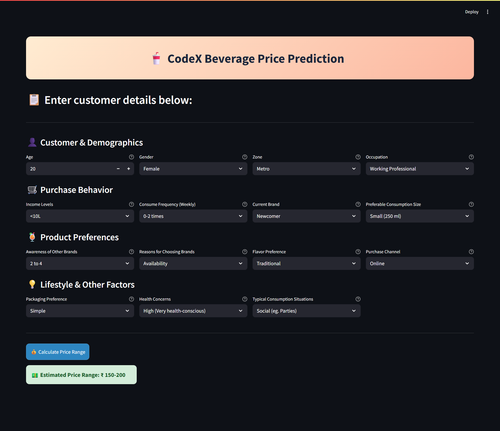

# Beverage Price Prediction

An interactive web application built with Streamlit that predicts the optimal market price range for beverages based on customer demographics, preferences, and lifestyle choices. By leveraging a trained machine learning model, the app helps beverage companies quickly estimate price points for different customer segments.

---

## 🌐 Live Website
You can try the tool live here: **[Beverage Price Prediction](https://vaibhav-project-beverage-price-prediction.streamlit.app/)**

---

## 🎥 Presentation
Watch the full project presentation here: **[Beverage Price Prediction Presentation](https://vaibhav-project.my.canva.site/beverage-price-prediction-presentation)**

---

## 🛠 Features  
- Sleek, responsive Streamlit interface with custom styling 
- Predicts beverage price ranges based on demographics & consumption patterns  
- Uses pre-trained machine learning models serialized with Joblib 
- Handles categorical and numerical inputs with one-hot encoding for accurate results
- Fully client-side — no backend or database required
- Fast, lightweight, and easy to run locally

---

## 📂 Project Structure

```
Beverage_Price_Prediction/
│
├── artifacts/                  # Serialized ML model
│   ├── model_data.joblib       # Trained model for price prediction
│
├── LICENSE                     # License file
├── README.md                   # This documentation
├── main.py                     # Streamlit app logic
├── prediction_helper.py        # Preprocessing & prediction functions
└── requirements.txt            # Python dependencies
```

---

## 🚀 How to Run Locally  
### Prerequisites:  
- Python 3.8+

1. **Clone the repository**:
   ```bash
   git clone https://github.com/vaibhavgarg2004/Beverage-Price-Prediction.git
   cd Beverage-Price-Prediction
   ```
2. **Install dependencies**:   
   ```commandline
    pip install -r requirements.txt
   ```
5. **Run the Streamlit app**:   
   ```commandline
    streamlit run main.py
   ```

---

## 🧠 How It Works

1. **User Inputs**  
   - **Age** (years)  
    - **Gender** (Male/Female)  
    - **Zone** (Urban, Rural, Metro, Semi-Urban)  
    - **Occupation** (Working Professional, Student, Entrepreneur, Retired)  
    - **Income Levels** (<10L, 10L – 15L, 16L – 25L, 26L – 35L, >35L)  
    - **Consume Frequency (Weekly)** (0–2 times, 3–4 times, 5–7 times)  
    - **Current Brand** (Established/Newcomer)  
    - **Preferable Consumption Size** (Small – 250 ml, Medium – 500 ml, Large – 1 L)  
    - **Awareness of Other Brands** (0 to 1, 2 to 4, above 4)  
    - **Reasons for Choosing Brands** (Price, Quality, Availability, Brand Reputation)  
    - **Flavor Preference** (Traditional/Exotic)  
    - **Purchase Channel** (Online/Retail Store)  
    - **Packaging Preference** (Simple, Premium, Eco-Friendly)  
    - **Health Concerns** (Low – Not very concerned, Medium – Moderately health-conscious, High – Very health-conscious)  
    - **Typical Consumption Situations** (Active – Sports/gym, Social – Parties, Casual – At home) 

2. **Price Prediction Logic**  
   - All customer demographic, behavioral, and preference inputs are converted into numerical and one-hot encoded features.  
   - Derived features such as `cf_ab_score`, `zas_score`, and `bsi` are computed from multiple inputs to capture behavior and   market factors.  
   - The processed feature vector is passed to the trained machine learning model (`model_data.joblib`).  
   - The model predicts the most likely price range index, which is then mapped to the actual price range (₹50–100, ₹100–150, ₹150–200, ₹200–250).  

3. **Prediction Flow**  
   - Input data is preprocessed with one-hot encoding and feature engineering in prediction_helper.py.
   - Preprocessed features are passed to the model_data.joblib trained ML model.
   - The model outputs a price category index, which is mapped to the final price range in ₹ and displayed instantly.

---
   
## 🖼️ Application Snapshot



---

## 📄 License
This project is licensed under the **Apache License 2.0**. See the [LICENSE](./LICENSE) file for details.

---

*Smart pricing for smarter decisions — instantly estimate beverage prices for any customer profile.*
